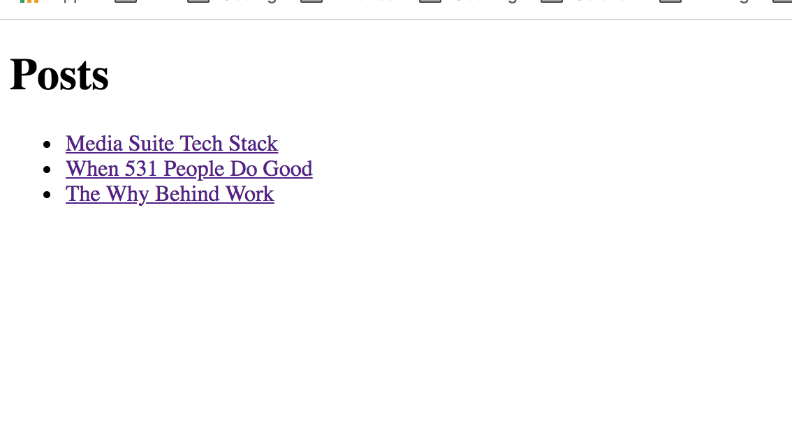
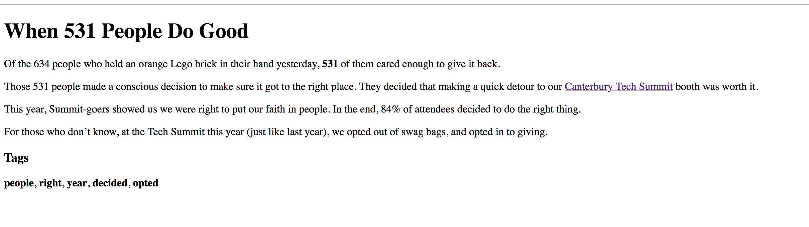

# Media Suite Coding Exercise
We’d like you to build a blogging platform!

This is a test of basic web development skills just to ensure you have the minimum skills required to learn the rest.

Please spend no more than two hours on this task.  We don’t want you to spend ages on this, we respect your time too much for that.  If you don’t finish, that’s fine, we’ll talk through what you have completed.

Please fork <github repo> and either email us a link to your public repo or zip up the source code and send it in (please don’t include a node_modules folder if you have one).

Please ensure we have enough information to run your code.  If we can’t figure out how to get it running, it’s been a waste of your time.

## The Output
It's okay for this application to look very basic. 
### The list of posts


### An individual post
 

## The Server
* The /assets/posts folder contains text files with blog data in them.  The file name is the URL slug.
* The content of each file will be in the following format
	```
	===
	Title: Blog Title
	Author: Author Name
	Slug: same-as-filename
	===
	# Markdown content will live here
	This is some markdown paragraph text
	```
* Create a server API GET endpoint that returns the blog data from these files, including tags representing the most common 5 word in the article, with stop words and mark-up from the markdown removed.  The return data format should look like this (values are representative only):
```
{
  post: {
    content: “... markdown content…”,
    tags: ['word1', 'word2', ...]
  }
}
```
* Create a server API GET end-point that returns the list of all blog titles, and allows you to link to the individual posts.
* Please build the server in either Express or Django.

## The Client
* The client code should consume data from the API and present it as HTML as two pages: a List of Posts and an individual Post.
* The tags should only be displayed on Post page, not on the List of Posts.
* Please build the client in whatever Javascript technology you feel most comfortable with; native JS, Ember, React, etc.
* Don’t worry about css, mark-up, etc.  It purely needs to demonstrate that the javascript is consuming your API and turning the json into useful content on-screen.
* We recommend you start by building the API to provide data to the client, but leave out the tags functionality initially.  Come back and complete the tags when the rest of the application is working.
